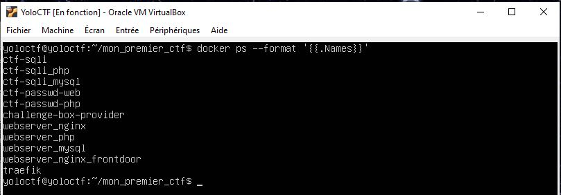
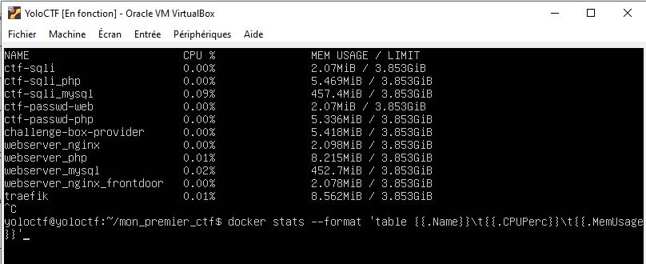
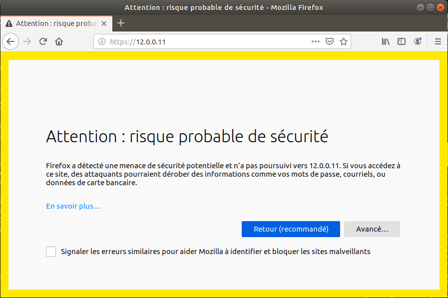
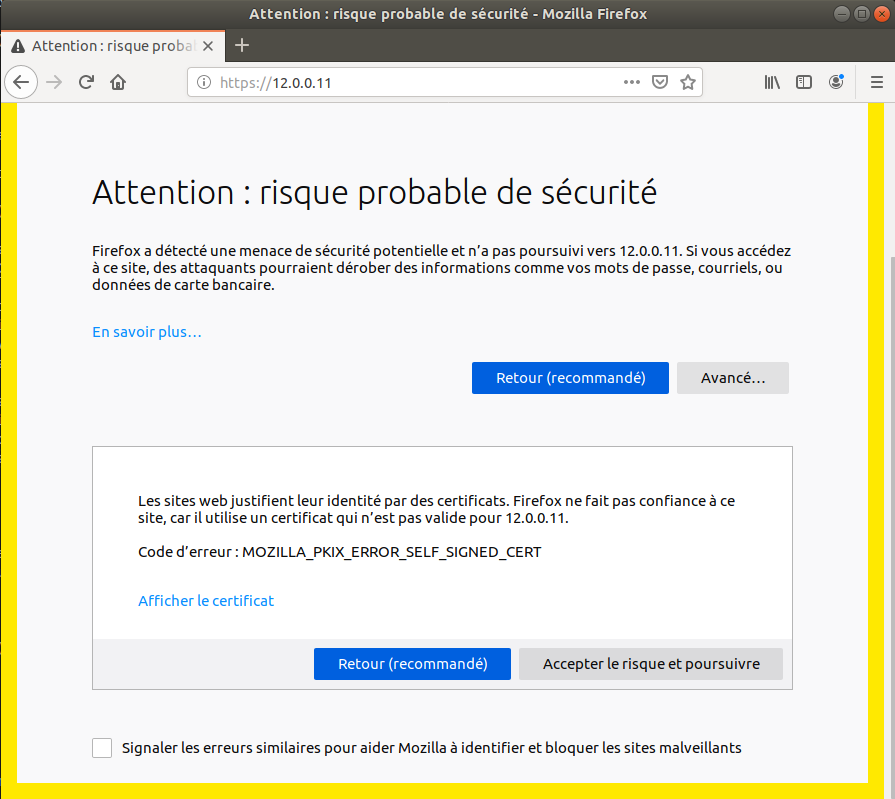
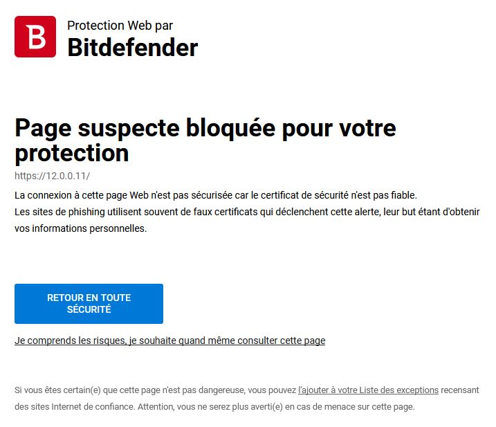

# Mon premier CTF


Vous désirez organiser un Capture The flag à destination de grands débutants ? Ce repo est pour vous !

Vous trouverez ici, une série de challenges destinés à permettre aux participants de commencer à se constituer la trousse à outil minimale pour participer à un CTF.


</br>
Un jeu de slide à destination des participants est disponible en https://github.com/monpremierctf/mon_premier_ctf/blob/master/doc/Introduction_au_CTF.pdf
</br>


## Pour découvrir sans contrainte 

```
http://yoloctf.org
```

</br>
Un serveur de test est disponible sur http://yoloctf.org. Vous pouvez vous créer un compte avec le code 'yolo'. Il est régulièrement effaçé et réinstallé. La durée de vie d'un profil est de 30h... Idéal pour un atelier de 2h qui déborde un peu. Ensuite le terminal ne se lance plus. Il faudra recréer un profil.
</br>


## Installation d'un serveur Yolo Ctf


### VM

```
https://yoloctf.org/yoloctf/iso/yoloctf.ova
```

Pour tester tranquillement sur mon PC, ou organiser un CTF sur mon LAN : Je télécharge une VM prète à l'emploi

[doc/install_vm.md](doc/install_vm.md)


### Install Package

```
https://yoloctf.org/yoloctf/iso/mon_premier_ctf_install.zip
```

Pour organiser un CTF sur Internet, je fais une installation sur un Ubuntu Server vierge chez Amazon ou OVH


[doc/install_ubuntu.md](doc/install_ubuntu.md)


### Monitorer le serveur et les containers

#### Liste des containers



```
docker ps --format '{{.Names}}'
```

#### Consommation CPU et mémoire par les containers



```
docker stats --format "table {{.Container}}\t{{.CPUPerc}}\t{{.MemUsage}}"
```

#### Analyse de logs

```
# docker logs challenge-box-provider
```

#### Monitoring global en interface web sur http://localhost:8888

````
chmod a+x tools/monitor.sh
tools/monitor.sh
````


### Accéder au site Web du CTF

Vous pouvez vous connecter avec votre navigateur Web : 
```
http://IP_DU_SERVEUR/
```

La connection en HTTP (tout les messages sont en clairs) va être redirigée vers une connection en HTTPS (les messages sont chiffrés et le serveur est authentifié).
Vous allez avoir une alerte de sécurité. C'est normal.



Le serveur Web a généré ses propres certificats pour utiliser une liaison HTTPS (HTTP Sécurisée). L'alerte vous prévient qu'aucune autorité de certification 'officielle' ne valide les clefs de sécurité de ce site, et qu'il peut donc y a donc un risque.



Il faut ajouter une exception  pour accepter le certificat non signé qui est présenté par le site.
Cliquez sur [ Accepter le risque et poursuivre]

Sur un autre navigateur (chrome, explorer..) ou si vous avez un antivirus installé le message peut être différent. Mais le principe reste le même. Il faut accepter de prendre le risque de reconnaitre le certificat autosigné du site.





## Administrer le CTF


## Participer au CTF


## Créer de nouveaux challenges
## 

## Prerequis

Prévoir une VM Ubuntu 18 vierge avec 3G de mémoire.</br>
Testé sur Ubuntu 18.04.01-desktop et Ubuntu 18.04.02-server avec un utilisateur ayant les droits sudo et appartenant au groupe docker.</br>
Un accès internet est indispensable pour télécharger les images docker de référence.</br>

</br>

Installer docker et docker-compose
```bash
$ sudo apt-get update
$ sudo apt-get install docker-compose
```

Les droits sudo ne servent que pour l'installation et le démarrage du service docker.</br>
L'installation, la configuration et le lancement des services du CTF se fait avec un compte utilisateur sans utiliser de sudo, sous réserve que le compte fasse parti du groupe 'docker'.  </br>

```bash
sudo gpasswd -a $USER docker
```
Après cet ajout, il faut déconnecter/reconnecter l'utilisateur. Idéalement rebooter le serveur...</br>

Lancer le service docker si ce n'est pas déjà fait
```bash
$ sudo service docker start
```

Eventuellement installer git
```bash
$ sudo apt-get install git
```

Eventuellement installer zip
```bash
$ sudo apt-get install zip
```
</br>

Eventuellement installer wget
```bash
$ sudo apt-get install wget
```
</br>


## Démarrage rapide 


Récupérer la dernière release de mon_premier_ctf sur github.
```bash
$ wget https://github.com/monpremierctf/mon_premier_ctf/archive/v0.1.0.tar.gz
$ tar xvf v0.1.0.tar.gz
$ cd mon_premier_ctf
```

Lancer l'installation initiale. Il faut télécharger toutes les images docker, et recompiler tous les programmes de zéro.
Ca va prendre environ 15 minutes avec une liaison fibre. Dont 8 minutes sur la seule commande Step 9/13 : RUN chown -R yolo:yolo /usr/src/app/. Faites une pause yoga. 
```
$ cd mon_premier_ctrf
$ ./go_first_install_webserver_run 

  __  __            ___               _            ___ _____ ___ 
 |  \/  |___ _ _   | _ \_ _ ___ _ __ (_)___ _ _   / __|_   _| __|
 | |\/| / _ \ ' \  |  _/ '_/ -_) '  \| / -_) '_| | (__  | | | _| 
 |_|  |_\___/_||_| |_| |_| \___|_|_|_|_\___|_|    \___| |_| |_| 

= Verification du système...
=> Verification : Ubuntu : Ok
#49-Ubuntu SMP Wed Feb 6 09:33:07 UTC 2019
=> Verification : Utilisateur non root : Ok
=> Verification : docker-compose installé : Ok
docker-compose version 1.17.1, build unknown
=> Verification : Docker installé : Ok
Docker version 18.09.2, build 6247962
=> Verification : python 2.7 installé : Ok
Python 2.7.15rc1
=> Verification : zip installé : Ok
=> Verification : Si non root, Utilisateur dans le group Docker : Ok
=> Verification : Docker démarré : Ok
Server Version: 18.09.2
Verification du système terminée
```
Le script vérifie que docker, docker-compose et tous les outils nécessaires sont installés et lancés...</br>
Si nécessaire, la commande d'installation est suggérée.</br></br>

La configuration, et le build des images docker des challenges se fait grace aux fichier ctf-xxx/.env et ctf-xxx/docker-compose
```

Lecture de la liste de challenges : challenges_list.cfg
Set IPSERVER=192.168.1.22
['ctf-shell', 'ctf-escalation', 'ctf-net', 'ctf-sqli', 'ctf-buffer', 'ctf-decode', 'ctf-transfert']

[ctf-shell/challenge_set_config.sh]
...
```
Le téléchargement des dockers peut prendre du temps sur une liaison adls, il y apres de 6G d'images...
````
Step 9/13 : RUN chown -R yolo:yolo /usr/src/app/. 
````
Cette commande peut prendre plus de 10 minutes.
Faites une pause yoga. 

Si vous avez une erreur de type
```
ERROR: Couldn't connect to Docker daemon at http+docker://localunixsocket - is it running?
```
c'est que docker n'est pas lancé. Faites
````
sudo reboot
````
Reconnectez vous, et relancez './go_first_install_webserver'.

</br>
</br>


## Première utilisation 

Lancer un navigateur sur http://localhost:/yoloctf/


</br>

# Monitoring du serveur et des containers


</br>

# Customisation

Pour ajouter des challenges jetez un oeil à : [doc/create_new_challenges.md](doc/create_new_challenges.md)


Enjoy !
