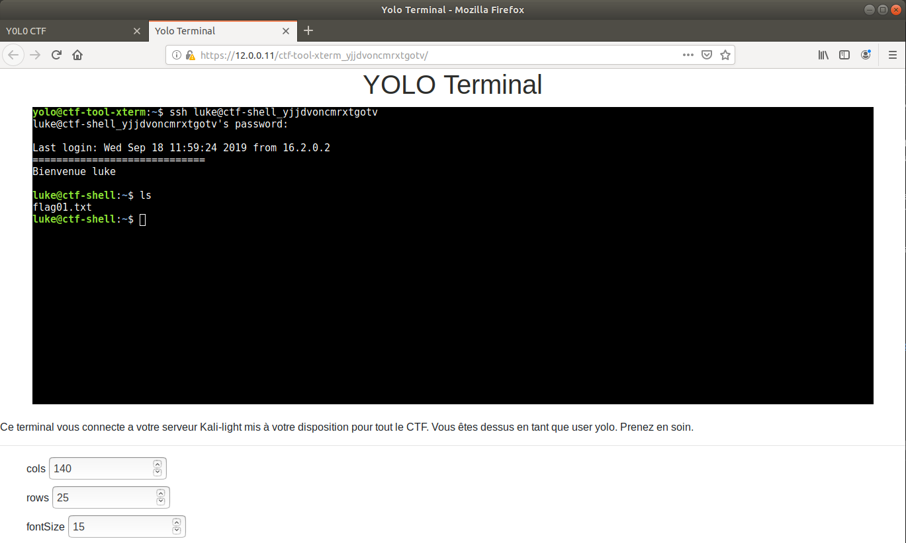
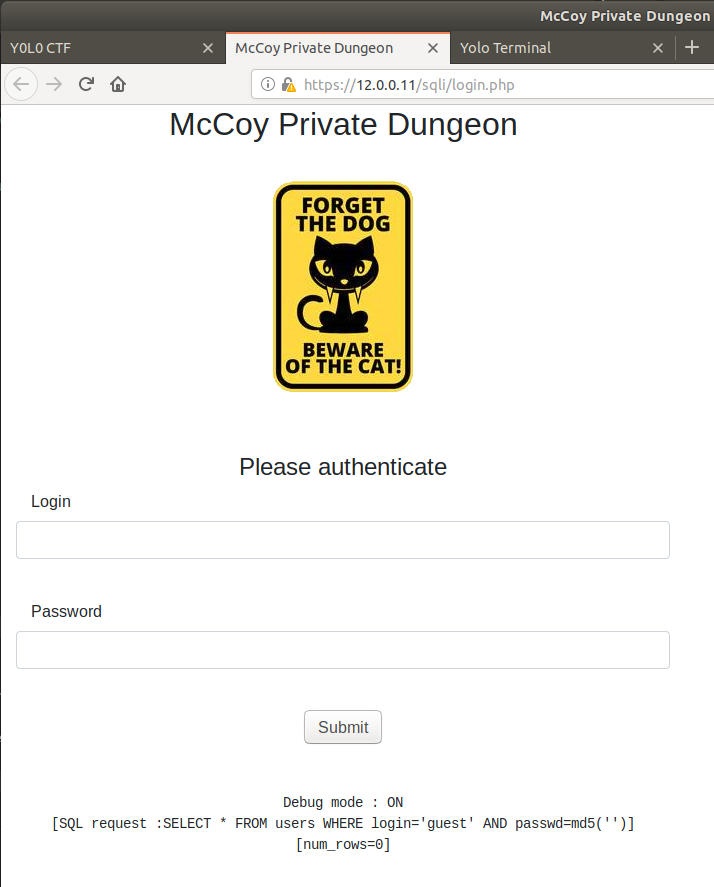
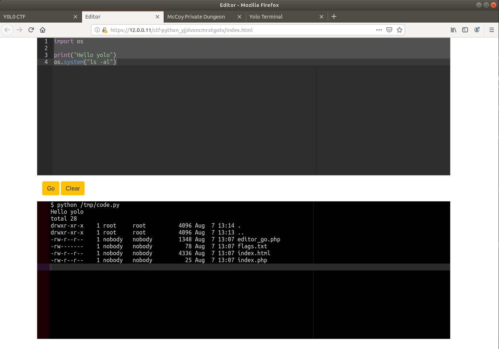
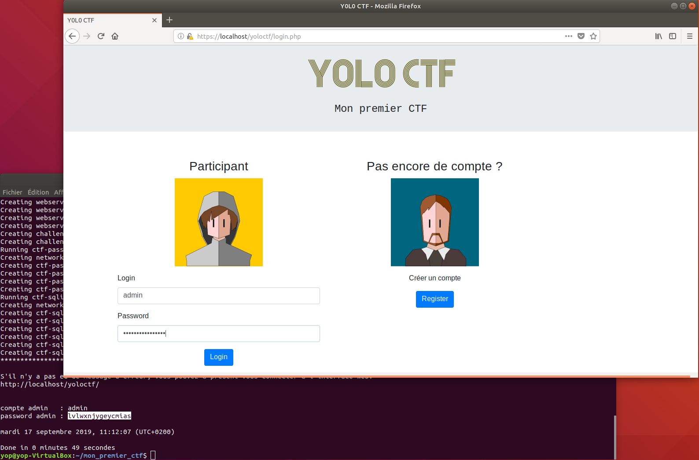
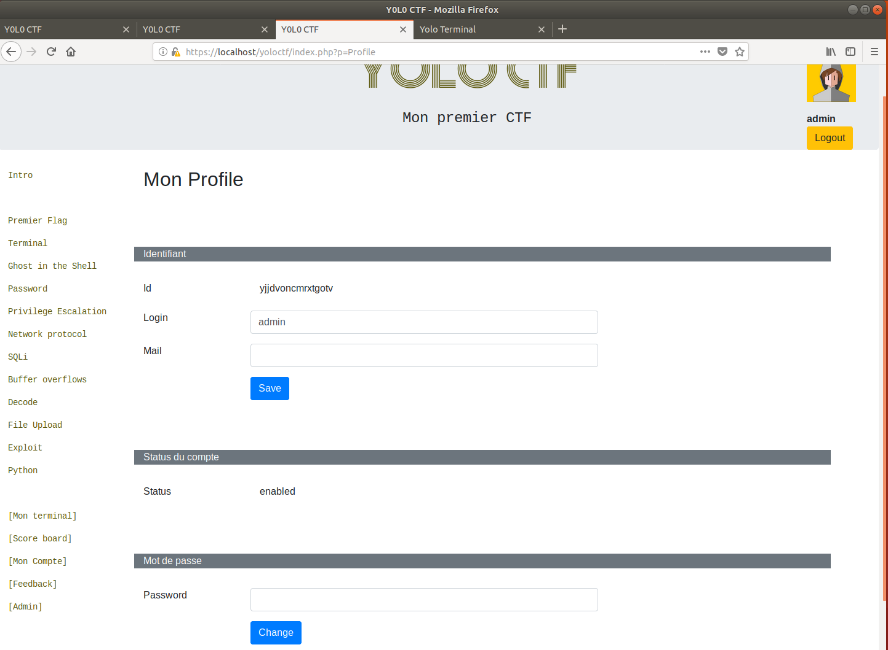

# Mon premier CTF


Vous désirez organiser un Capture The flag à destination de grands débutants ? Ce repo est pour vous !

Vous trouverez ici, une série de challenges destinés à permettre aux participants de commencer à se constituer la trousse à outil minimale pour participer à un CTF.


</br>
Un jeu de slide à destination des participants est disponible en https://github.com/monpremierctf/mon_premier_ctf/blob/master/doc/Introduction_au_CTF.pdf

</br>

Vous trouverez dans ce document des instructions détaillées sur :

- [Les fonctionnalités de la plateforme](#Fonctionnalités)
- [Installer et lancer le serveur](#Installer-et-démarrer-le-serveur)
- [Se connecter au CTF](#Participer-au-CTF)
- [Administrer le serveur avec l'interface web](#Administrer-le-CTF)
- [Monitorer le serveur dans la console](#Monitorer)
- [Customiser le CTF en choisissant/ajoutant des challenges](#Customisation)


</br>
</br>

# Fonctionnalités

Tous les challenges sont accessibles à travers le navigateur Web.
Il n'y a aucune installation à faire sur le poste des utilisateurs.


## Challenges textuels


## Utilisation d'un terminal 'Kali like' dans le browser




## Lancement à la demande de serveurs dédiés


## Serveur de type ssh ou Web




## Editeur et Execution de code python




</br>
</br>

# Installer et démarrer le serveur

3 types d'installations sont possibles:

- Zéro install: le site http://hacklab.yoloctf.org
- Installation de la VM pré-configurée
- Installation de zéro sur un serveur ubuntu

</br>

## Methode 1: Zero install  


```
http://hacklab.yoloctf.org
```

</br>
Un serveur de test est disponible sur http://hacklab.yoloctf.org. Vous pouvez vous créer un compte avec le code 'PT' (on vous demande de ne pas tout péter ;) c'est plus un terrain de jeu qu'un serveur de prod, et il est régulièrement down). Il est régulièrement effaçé et réinstallé. 
Ce serveur utilise des repo git supplémentaires qui sont testés et intégré à yoloctf au fur et à mesure. Lancement de VM de vulnhub, challs supplémentaires...

</br>
</br>
</br>

## Methode 2: Installation de la VM YOLO CTF

```
https://yoloctf.org/yoloctf/iso/yoloctf.ova
```

Pour tester tranquillement sur mon PC, ou organiser un CTF sur mon LAN : Je télécharge une VM prète à l'emploi

[==> Instructions pour l'installation de la VM](doc/install_vm.md)


</br>
</br>
</br>

## Methode 3: Installation from scratch sur Ubuntu

```
git clone https://github.com/monpremierctf/mon_premier_ctf.git
cd monpremierctf
./go_launch_first_install_webserver_run
```

Pour organiser un CTF sur Internet, je fais une installation sur un Ubuntu Server vierge chez Amazon ou OVH


[==> Instructions pour l'installation sur un serveur ubuntu vierge](doc/install_ubuntu.md)


</br>
</br>
</br>


# Participer au CTF


## Accéder au site Web du CTF

Vous pouvez vous connecter avec votre navigateur Web : 
```
http://IP_DU_SERVEUR/
```

La connection en HTTP (tout les messages sont en clairs) va être redirigée vers une connection en HTTPS (les messages sont chiffrés et le serveur est authentifié).
Vous allez avoir une alerte de sécurité. C'est normal.


Le serveur Web a généré ses propres certificats pour utiliser une liaison HTTPS (HTTP Sécurisée). L'alerte vous prévient qu'aucune autorité de certification 'officielle' ne valide les clefs de sécurité de ce site, et qu'il peut donc y a donc un risque.


Il faut ajouter une exception  pour accepter le certificat non signé qui est présenté par le site.
Cliquez sur [ Accepter le risque et poursuivre]

Sur un autre navigateur (chrome, explorer..) ou si vous avez un antivirus installé le message peut être différent. Mais le principe reste le même. Il faut accepter de prendre le risque de reconnaitre le certificat autosigné du site.


</br>
</br>
</br>


# Administrer le CTF

## Se logguer avec le compte Admin



Le mot de passe du compte admin est donné dans le terminal:
- admin
- lvlwxnjygeycmias

</br>

## Changer le mot de passe du compte Admin

Le mot de passe étant prédéfini sur la VM, il est nécessaire de le changer :


Allez sur l'onglet 'Mon Compte' dans la table des matières en bas à gauche.
Définissez un nouveau mot de passe et cliquez [Change].

</br>


## Monitoring light


L'onglet [Admin] en bas à gauche permet de voir :
- Le nombre de sessions actives
- Le nombre d'utilisateurs
- Les flags soumis par les utilisateurs
- Les containers démarrés par les utilisateurs

</br>


## Reseter les Flags


Dès l'instant ou le serveur est démarré, les participants peuvent commencer à valider les flags.
Vous pouvez aussi vouloir tester un peu. Le lien [ClearFlags] en bas de page permet d'effacer tous les flags validés.

</br>


## Consultez les feedbacks

L'onglet Feedback est à utiliser pour obtenir un retour des utilisateurs en fin de CTF, et permet de détailler un problème rencontré sur le site ou un challenge.


</br>
</br>
</br>


# Monitorer

## Monitoring du serveur et de ses containers

Une fois que votre serveur tourne, c'est une bonne idée de surveiller ce qui se passe et vérifier la mémoire libre, la charge du CPU et la place restante sur le disque.

#### Liste des containers


```
docker ps --format '{{.Names}}'
```

#### Consommation CPU et mémoire par les containers


```
docker stats --format "table {{.Container}}\t{{.CPUPerc}}\t{{.MemUsage}}"
```

#### Analyse de logs

```
# docker logs challenge-box-provider
```

#### Monitoring global en interface web sur http://localhost:8888

````
chmod a+x tools/monitor.sh
tools/monitor.sh
````


</br>
</br>

# Customisation

Pour ajouter des challenges jetez un oeil à : [doc/create_new_challenges.md](doc/create_new_challenges.md)


Enjoy !
